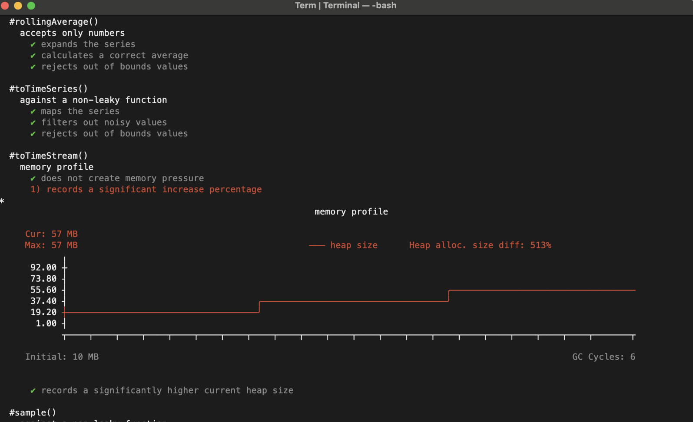

[![test-workflow][test-workflow-badge]][ci-test]

# heapstats

terminal-based [V8 heap allocation stats][oil] plotter

<picture>
  <source media="(prefers-color-scheme: dark)" srcset=".github/docs/demo.png">
  
</picture>

<picture>
  <source media="(prefers-color-scheme: dark)" srcset=".github/docs/demo.png">
  
</picture>


## Install

```bash
npm i git+ssh://git@github.com:nicholaswmin/heapstats.git
```

## Usage


```js
import Heapstats from 'heapstats'

const heap = Heapstats()

for (let i = 0; i < 100; i++)
  addTwoNumbers(5, 3)


console.log(heap.stats().plot)
```

```text
                                  Heap Allocation Timeline

Cur: 21.79 MB
Max: 56.77 MB                        Heap increased: 376%
      ╷
56.77 ┼                                 ╭─╮                                 
45.62 ┤                            ╭────╯ │    ╭────╮     ╭────╮    ╭────╮  
34.46 ┤                      ╭─────╯      ╰────╯    │  ╭──╯    │ ╭──╯    │  
23.31 ┤            ╭────╮  ╭─╯                      ╰──╯       ╰─╯       ╰─
12.15 ┤       ╭────╯    ╰──╯                                                
 1.00 ┼───────╯                                                             
      ┬───┬───┬───┬───┬───┬───┬───┬───┬───┬───┬───┬───┬───┬───┬───┬───┬───┬

Initial: 4.57 MB                                               GC Cycles: 27
```


Measuring the heap alloc. timeline of an HTTP request

```js

const heap = Heapstats()


app.get('/users', (req, res) => {
  const users = await leakyDatabaseCall()

  res.json(users)

  console.log(heap.stats().plot)
})
```

### Heap allocation statistics

Apart from the ASCII plot, `heap.stats()` returns:

```js
{
   // heap size on instantiation, since `Heapstats()`
  "initial": 16863610,
  // heap size now
  "current": 86857600,
  // max. heap size since `Heapstats()`
  "max": 104857600,
   // diff. of initial and current, expressed as %
  "increasePercentage": 2.4,
   // collected stats of each garbage collection
  "snapshots": [V8HeapStats, V8HeapStats ...]
}
```

size values are expressed in bytes

A `V8HeapStats` object contains [Oilpan's][oil] *garbage collection statistics*,
as captured by [v8.getHeapStatistics()][v8-heap-doc], in both bytes and
megabytes.

These stats are collected *immediately* after a
garbage collection / compaction cycle.


## As a unit-testing utility

This tool was made for unit-testing

In [Mocha][mocha], you can pass the test context to heapstats, like so:

```js

Heapstats({ test: this })
```

the plot will auto-draw itself next to its test, if the **test fails**.


```js
describe ('addTwoNumbers()', function() {
  it ('adds 2 numbers', function() {
    const result = addTwoNumbers(2, 3)

    result.should.be.a('Number').equal(5)
  })

  describe ('when run 100 times', function() {
    this.heap = Heapstats({ test: this })

    for (let i = 0; i < 100; i++)
      addTwoNumbers(2, 3)
  })

  it ('does not leak memory', async function() {
    expect(this.heap.stats().current).to.be.below(10)
  })

  it ('does not exceed 100 MB in memory usage', async function() {
    expect(this.heap.stats().max).to.be.below(100)
  })

  // ... and so on ...
})
```

### Tail mode


To observe realtime heap statistics:


```js
import Heapstats from 'heapstats'
```

and start with flag `--heapstats`, i.e:

```bash
node app.js --heapstats
```

which does this:

![GIF showing realtime memory usage as a line plot, in terminal][tail-demo]

This is useful when prototyping.

**Note** that while the tail mode is pinned, any output to `stdout`/`stderr`
is suppressed to avoid interference with the plot redraw cycle.

In other words `console.log`/`console.error` etc won't output anything
while the plot is tailing.

## Test

```bash
npm test
```

> A nice test skeleton

```js
describe('test..', function() { // regular function-callback
  // Non-global handler,
  // scoped in a describe
  beforeEach(function() {
    // proper, non-global setup
    this.heap = Heapstats({ test: this })

    this.leak = ''
    setInterval(leak => {
      this.leak += JSON.stringify(Array.from({ length: 200 }).fill('x'))
    }, 500, this.leak)

    this.stats = heap.stats()
  })

  // clean up after yourself :)
  afterEach(function() {
    this.leak = undefined
    global.gc()
  })

  // start testing...
  it('does not create memory spikes', function() {
    this.stats.max.should.be.less.than(10000)

    // ... and so on...
  })
})
```

[More examples here][examples].

### License

> 2024 Nik Kyriakides, [@nicholaswmin][nicholaswmin]

> The MIT License
> SPDIX: MIT

> Permission is hereby granted, free of charge, to any person obtaining a copy
> of this software and associated documentation files (the "Software"), to deal
> in the Software without restriction, including without limitation the rights
> to use, copy, modify, merge, publish, distribute, sublicense, and/or sell
> copies of the Software, and to permit persons to whom the Software is
> furnished to do so.

[nicholaswmin]: https://github.com/nicholaswmin
[test-workflow-badge]: https://github.com/nicholaswmin/memstat/actions/workflows/tests.yml/badge.svg
[ci-test]: https://github.com/nicholaswmin/heapstats/actions/workflows/tests.yml
[v8-heap-doc]: https://nodejs.org/api/v8.html#v8getheapstatsistics
[mdn-perf-observe]: https://developer.mozilla.org/en-US/docs/Web/API/PerformanceObserver
[oil]: https://v8.dev/blog/oilpan-library
[tail-demo]: .github/docs/tail-demo.gif
[mocha]: https://mochajs.org/
[no-mocha-arrow]: https://github.com/meteor/guide/issues/318
[examples]: .github/examples
[brittle-tests]: https://abseil.io/resources/swe-book/html/ch12.html
[streams]:https://en.wikipedia.org/wiki/Stream_(computing)
